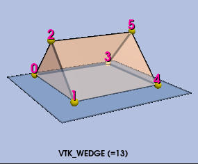

# Viskores 1.2.0 Release Notes

## Table of Contents
1. [Core](#core)
   - Viskores now requires initialization
   - Checking of class triviality is improved
   - Fixed memory_order constants for C++20
   - Added check for Kokkos finalize
   - Avoid copies on AMD APUs in the Kokkos build of Viskores
   - Add id-only cell locator queries
2. [Filters](#filters)
   - Fiber Uncertainty Visualization Filter
   - Spline evaluation on structured grids
   - Monotonicity checks for arrays
   - Deprecated CPU threading for multiblock filters
   - Use id-only block lookup for flow bounds
3. [Rendering](#rendering)
   - New ANARI device enabled by Viskores
   - Pan with 3D camera fixed
4. [Bug Fixes](#bug-fixes)
   - Bug fix for CellLocatorBoundingIntervalHierarchy
   - Fix array access for rectilinear splines
   - Contour Tree Filter No Longer Stores Execution Scratch as Filter State
   - Wedge: Fix Point Ordering, Triangulation and Volume Correctness
   - Fixed bug in Kokkos Reduce function
5. [Build](#build)
   - Made the device library private
   - Removed redundant version information from libraries
   - pkg-config files now install to libdir/pkgconfig
   - Use compliant MSVC preprocessor for device code
   - Improve compilation of flow filters
   - Testing code consolidated
   - Support skipping tests
   - Fixed the SetupForDevelopment.sh script
   - Patches are uploaded when formatting fails
   - Contour Tree Filter Headers Isolated from Device Code
   - Raytracing code separated into its own module
   - Shorten header filenames to fix Windows MAX_PATH install failures
   - Fixed error about ambiguous thrust namespace
   - Remove warnings for deprecated Thrust utilities

## Core

### Viskores now requires initialization

It is now required to call `viskores::cont::Initialize` before using other
features in Viskores. This change has come about to ensure that resources are
managed correctly.

A new function, `viskores::cont::IsInitialized` has also been added to help
client code ensure `Initialize` is called exactly once.

### Checking of class triviality is improved

When Viskores packages classes to send between host and device as well as when
Viskores usings Variants to build unions of objects, it can be important to
check trivial aspects of classes. For example, it is sometimes important to know
whether the class executes code for its constructors or destructor.

Early forms of Viskores (actually its predecessor VTK-m) used compilers that did
not give reliable results for `std::is_trivial` and related type checks. To get
around this problem on these compilers, Viskores implemented alternate forms of
these checks that reported nothing as trivial so that proper construction copy
or destruction happened. This alternate implementation also reported that
everything _was_ trivial during assert checks in places where objects needed to
be memory copied. (Other compilers were used to ensure that these checks passed
correctly.)

Now that Viskores requires C++17 or better, compilers _should_ properly
implement these checks that have been around since C++11. Thus, the workarounds
for bad implementations of `std::is_trivial` should not be necessary, and they
have been removed.

### Fixed memory_order constants for C++20

C++20 changed the implementation of the `std::memory_order` enum to be scoped.
As part of that, the contents of the enum have different names. Instead, you
reference the identifiers as constants in the `std` namespace (which works the
same with the non-scoped version).

At any rate, the code now works for both C++17 and C++20.

### Added check for Kokkos finalize

Previously, if Viskores initialized Kokkos, it would always fall the Kokkos
finalize routine. This assumed that all other Kokkos users would follow the same
pattern of checking before initializing Kokkos and finalizing if and only if
Viskores initialized.

However, a more aggressive library may always finalize on shutdown if it detects
Kokkos was ever initialized. To play well with such libraries, Viskores now also
checks to make sure that Kokkos has not yet been finalized.

This cannot guarantee that another library may finalize Kokkos after Viskores,
but it will work with any libraries that either only finalize if they do the
initialization or check before initializing or finalizing.

### Avoid copies on AMD APUs in the Kokkos build of Viskores

APUs, such as the AMD Instinct MI300A, are a special kind of accelerator where the CPU and GPU physically share their memory.
The Kokkos build of Viskores now takes this characteristic into account by defining `VISKORES_PHYSICALLY_SHARED_MEMORY` and performing shallow copies between host and device, if the device is an APU.

### Add id-only cell locator queries

Viskores cell locators now provide `FindCellId` and `FindAllCellIds` methods
for queries that only need cell ids and do not need parametric coordinates.

## Filters

### Fiber Uncertainty Visualization Filter

Viskores now provides a function to compute the positional probability of fibers
when input bivariate scalar data are uncertain. Fibers are a conceptual extension
of univariate isosurfaces (Carr et al., 2015); they represent the preimage of a
user-specified bivariate trait, analogous to an isovalue in the univariate case.
The positional probability of fibers can be computed for uniformly distributed
uncertain data sampled on a regular grid using the FiberUncertainUniform filter.
The bounds of the uniform distribution are estimated from the input ensemble by
computing the minimum and maximum values of each variable.

### Spline evaluation on structured grids

Viskores now supports interpolation of scalar data on structured grids through two new classes:
viskores::cont::SplineEvaluateUniformGrid for uniform grids;
viskores::cont::SplineEvaluateRectilinearGrid for rectilinear grids.

Both classes implement Catmull-Rom spline interpolation, providing smooth and accurate evaluation of scalar values.

### Monotonicity checks for arrays

Viskores has two new functions to test whether a scalar-valued array is monotonically increasing or monotonically decreasing.
`viskores::cont::ArrayIsMonotonicIncreasing` returns `true` if the array is monotonically increasing.
`viskores::cont::ArrayIsMonotonicDecreasing` returns `true` if the array is monotonically decreasing.

Both functions use `viskores::cont::UnknownArrayHandle` as the input argument so that it can support any type of underlying array storage.

### Deprecated CPU threading for multiblock filters

OpenMP and TBB backends are not threadsafe. Disable setting number of threads for these backends.

### Use id-only block lookup for flow bounds

Flow filters now build an internal block-bounds locator that can identify all
blocks containing a particle position using cell-id-only locator queries. This
provides the foundation for more efficient worklet-based particle routing across
overlapping blocks.

## Rendering

### New ANARI device enabled by Viskores

Viskores now provides an ANARI device that can be used by applications that use
ANARI for rendering. The intention of this device is to provide a simple,
portable, accelerated ANARI device that will be available in HPC systems
regardless of vendor support. We hope this will help jumpstart the support of
ANARI for scientific visualization applications at HPC centers.

This device is still in its experimental phase. Although functional, it is
missing many features that applications will expect to be supported. The
inclusion of the device into Viskores in this early phase should help promote
development and simplify the integration of any changes necessary in the
rendering library.

### Pan with 3D camera fixed

Although the `Camera` object for 3D rendering provided panning
options in the image plane, the underlying camera in the raytracing
code did not support it. The raycast mapping now supports X/Y panning
when rendering 3D objects.

## Bug Fixes

### Bug fix for CellLocatorBoundingIntervalHierarchy

Fixes a memory error that was showing up on GPUs.

Fixed one bug where BIH could keep searching after already finding cell 0, which could cause invalid memory access. Fixed a second bug where stale cached leaf data could be reused incorrectly, leading to bad reads in the LastCell fast path.

### Fix array access for rectilinear splines

The rectilinear spline execution object needs to know the
bounds of the coordinates. These were computed by loading
the first and last items of the coordinate arrays. However,
these arrays are on the device and the bounds are computed
on the host. Thus, for devices with different memory spaces
this could give bad values.

Fix the problem by using the `GetBounds` method on the
`CoordinateSystem` object, which will compute it correctly.

### Contour Tree Filter No Longer Stores Execution Scratch as Filter State

The `ContourTreeUniformDistributed` filter previously held its intermediate
results (local meshes, contour trees, boundary trees, interior forests, and the
iteration count) as filter member state. Because filters can be copied, copies
could share or clobber this mutable scratch when executed independently.

These intermediate results are now collected in a local `ExecutionState` object
that lives only for the duration of a single execution and is passed by
reference through the filter's helper functions. Copies of the filter no longer
share execution scratch.

### Wedge: Fix Point Ordering, Triangulation and Volume Correctness

This series of commits fixes long-standing issues with wedge cell types in Viskores inherited from VTK,
where point orderings were inconsistent with parametric coordinates, leading to
incorrect volume computations, negative volume tetrahedra in triangulations, and
faces with incorrect outward normals. The fixes are mentioned below:

`Wedge`
  - Correct Point Ordering
    1. Wrong Wedge Point Ordering: 
    2. Corrected Wedge Point Ordering: 
  - Use outward normal winding for each face, which was broken as a result of the incorrect point ordering
  - Fix `TriangulateTables` to produce positive volume tetrahedrons
  - Fix `ClipTables` to produce correct point/edge ordering with positive volume wedges
  - Fix `MarchingCellTables` for contouring to produce correct point/edge ordering
  - Fix tests generating wrong point ordering
   
Additionally, the edge interpolation was fixed to consider edge points with equal scalar values.

### Fixed bug in Kokkos Reduce function

The `Reduce()` function in the Kokkos device adapter had a potential bug where
it would attempt to access an array on the host. Normally, it is fine to request
an array handle on the host with, for example, the `ReadPortal()` method.
However, in some rare cases with custom array handles, the portal specifically
accesses functions or data on the device. This was the case for the
`CountBitSet` method in the Kokkos device adapter, and that could ead to
problems such as a segmentation fault. The `Reduce()` is now more careful to
access its input array only on the device.

## Build

### Made the device library private

Viskores no longer makes the device libraries public on its exported
`viskores::cont` target. Previously, the device libraries were linked to
`viskores::cont` as `PUBLIC`, which means that pretty much anything that used
Viskores also brought in any compiler flags for the device. This sometimes
forced downstream code to use a device compiler when it did not need to.

### Removed redundant version information from libraries

The Viskores library files were created with redundant version information. The
library name added the major.minor numbers to the filename, but then CMake
automatically added these numbers a second time. This redundant information has
been removed.

### pkg-config files now install to libdir/pkgconfig

Viskores now installs pkg-config files to `${Viskores_INSTALL_LIB_DIR}/pkgconfig` instead of the
share directory. This is the default location where pkg-config searches for
.pc files, allowing pkg-config to find Viskores without additional configuration.

### Use compliant MSVC preprocessor for device code

MSVC has some behavior in their "traditional" preprocessor that is not compliant
with the C99 and C++11 standards. Starting in MSVC 19 (the current earliest
version supported by Viskores), MSVC provides a "compliant" preprocessor that
does meet C and C++ standards. This is enabled with the `/Zc:preprocessor`
command line flag.

Some device libraries (in particular, Thrust) require this compliant preprocess
to be used for compatibility. (See bug [#276].) To support that, Viskores now
adds the `/Zc:preprocessor` flag to compilations of device code. This is done by
adding the compile option to the `viskores_exec` interface library.

[#276]: https://github.com/Viskores/viskores/issues/276

### Improve compilation of flow filters

Several of the flow filters contain multiple flow paths through different
worklets. This can sometimes overwhelm device compilers. To improve compilation,
the compilation of worklets for the flow filters is separated into different
translation units using the Viskores instantiation compile feature. This reduces
the burden on any particular use of a compiler and helps leverage parallel
compiling.

### Testing code consolidated

The testing helper code in Viskores has been consolidated. Originally, there was
a separation between the tests that used code in the control environment and
that which did not. This was originally from back in the day when Viskores (or
rather, its predecessor) was envisioned as a header-only library. However, this
separation is no longer meaningful. In fact, the testing code without the
control environment was missing some initialization that can cause issues with
some devices.

Now, all the testing helper code is accessible from
`viskores/testing/Testing.h`. The old `viskores/cont/testing/Testing.h` still
exists (for now), but it is an empty file pointing back to
`viskores/testing/Testing.h`.

### Support skipping tests

Viskores tests can now skip themselves. Sometimes it is not possible to
determine whether a particular test is supported until the test is run and the
system can be introspected. In this case, the test can now return by invoking
the `VISKORES_TEST_SKIP`. In this case, the test will immediately end, and CTest
will report that the test was skipped rather than pass or fail.

### Fixed the SetupForDevelopment.sh script

The [CONTRIBUTING.md] document instructs developers to run the
`Utilities/SetupForDevelopment.sh` script. However, when you ran this script,
you got an error:

```bash
$ ./Utilities/SetupForDevelopment.sh
Setting up useful Git aliases...
./Utilities/SetupForDevelopment.sh: line 22: syntax error: unexpected end of file
```

This error has been fixed, and the `SetupForDevelopment.sh` script now correctly
sets up git aliases.

[CONTRIBUTING.md]: https://github.com/Viskores/viskores/blob/main/CONTRIBUTING.md#setup

### Patches are uploaded when formatting fails

To ensure that the Viskores source maintains consistent formatting, every GitHub
pull request must pass a formatting check. If this check fails, developers must
change their code to conform to the proper formatting.

To assist developers in correcting the formatting, the GitHub workflow now
updates a patch file as an artifact. When developers get the formatting failure,
they can go to the output of the check and download the patch file and apply it
locally to fix the formatting issues.

### Contour Tree Filter Headers Isolated from Device Code

Some of the contour tree filter headers included internal classes that exposed
device (execution environment) code. Filters should not do that so software
using the filters can avoid compiling with the GPU compiler if they otherwise do
not need it. The contour tree filter code is updated to avoid such extraneous
includes.

### Raytracing code separated into its own module

The raytracing code, placed in the raytracing subdirectory/namespace under
rendering is now in its own library (`viskores::rendering_raytracing`) that does
not depend on the rest of the rendering code (i.e., the `viskores::rendering`
library). Previously, this code was intertwined and in one library.

This separation will allow more options to implement rendering features using
other libraries that partially use raytracing (such as the ANARI interop).

### Shorten header filenames to fix Windows MAX_PATH install failures

Viskores header files were renamed to have shorter paths so that they can be
installed on Windows systems without Long Path support enabled. This fixes
failures seen when installing Viskores via conda on Windows instances where
the total installed path exceeded the 260-character MAX_PATH limit.

A CI check is now enforced to ensure no source file path exceeds 130
characters, leaving sufficient headroom for typical install prefixes.

### Fixed error about ambiguous thrust namespace

There are a few places in Viskores that have to modify the internal behavior of
Thrust to, for example, properly identify a reference object as a read/write
reference. However, recent versions of thrust sometimes caused a compiler error
about the `thrust::detail` namespace being ambiguous. This is because Thrust has
its special ABI that declares things in anonymous spaces to avoid conflicts.

When Viskores touches internal components of Thrust, it now uses the
`THRUST_NAMESPACE_BEGIN`/`END` macros to define the namespace so it follows how
things are defined by Thrust.

### Remove warnings for deprecated Thrust utilities

The use of Thrust function objects such as `thrust::less`, `thrust::equal_to`,
and `thrust::plus`, as well as utilities such as `thrust::distance`, is
deprecated. These are replaced with the more general `cuda::std` equivalents.
The Viskores code is updated to point to the latter classes and functions for
newer versions of Cuda.
