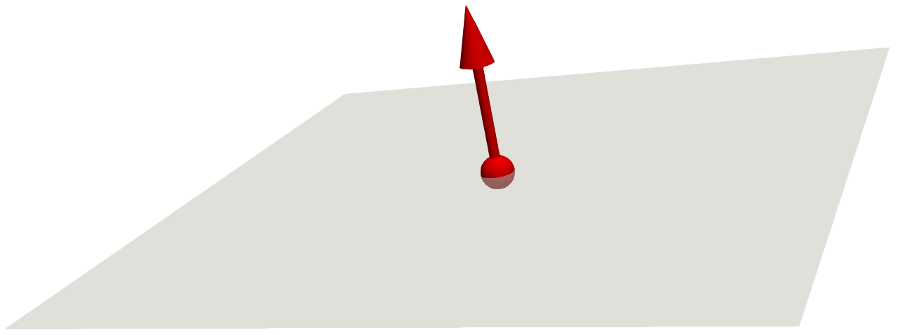
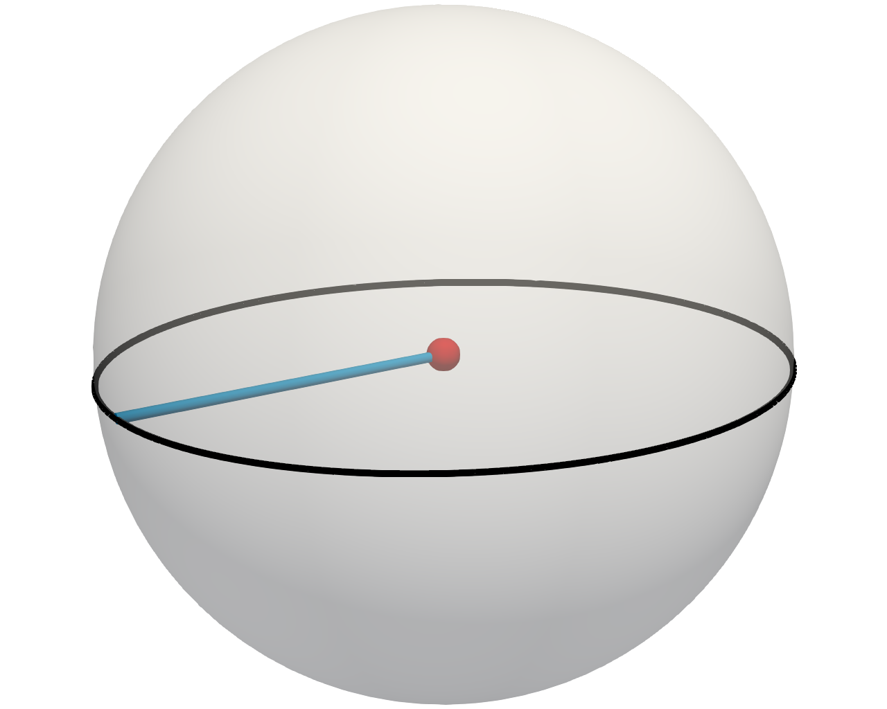
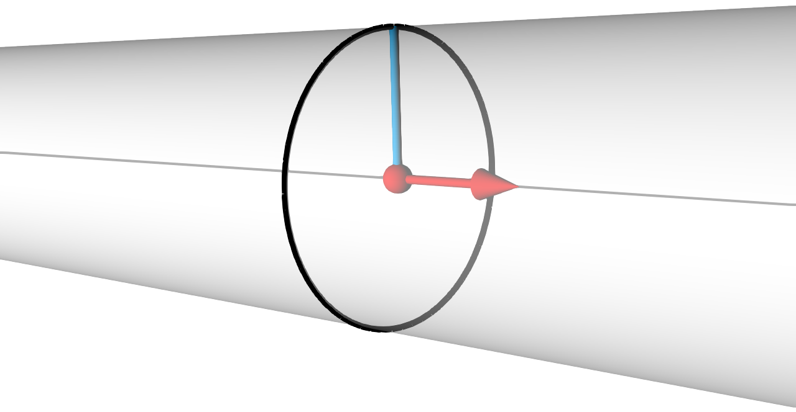
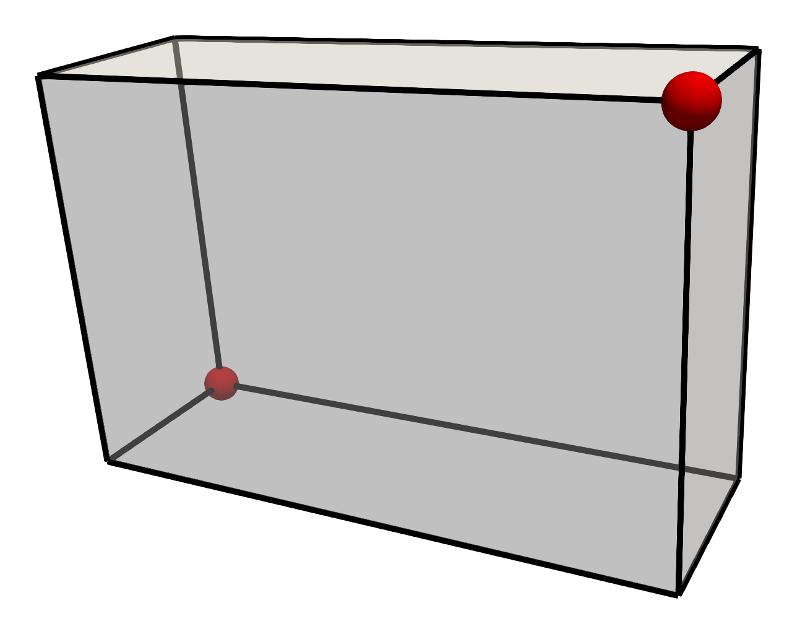
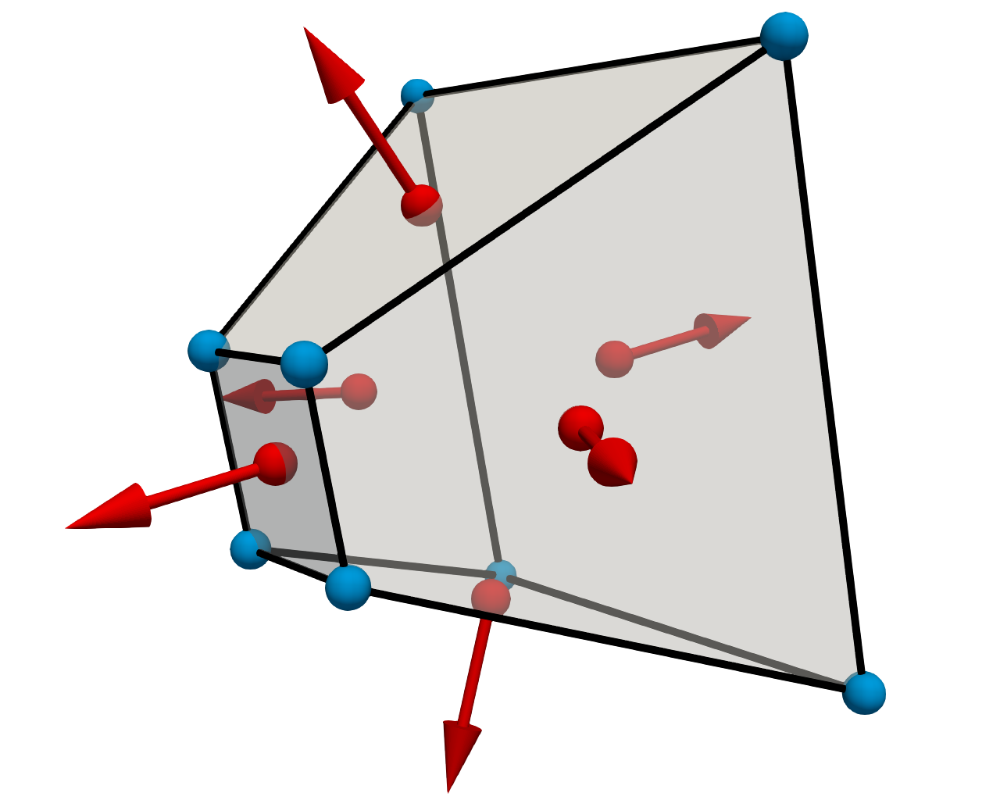

==============================
Implicit Functions
==============================

.. index:: implicit function
.. index:: functions; implicit

|Viskores|'s implicit functions are objects that are constructed with values representing 3D spatial coordinates that often describe a shape.
Each implicit function is typically defined by the surface formed where the value of the function is equal to 0.
All implicit functions implement ``Value()`` and ``Gradient()`` methods that describe the orientation of a provided point with respect to the implicit function's shape.

The ``Value()`` method for an implicit function takes a :type:`viskores::Vec3f` and returns a :type:`viskores::FloatDefault` representing the orientation of the point with respect to the implicit function's shape.
Negative scalar values represent vector points inside of the implicit function's shape.
Positive scalar values represent vector points outside the implicit function's shape.
Zero values represent vector points that lie on the surface of the implicit function.

The ``Gradient()`` method for an implicit function takes a :type:`viskores::Vec3f` and returns a :type:`viskores::Vec3f` representing the pointing direction from the implicit function's shape.
Gradient calculations are more object shape specific.
It is advised to look at the individual shape implementations for specific implicit functions.

Implicit functions are useful when trying to clip regions from a dataset.
For example, it is possible to use :class:`viskores::filter::contour::ClipWithImplicitFunction` to remove a region in a provided dataset according to the shape of an implicit function.
See :secref:`provided-filters:Clip with Implicit Function` for more information on clipping with implicit functions.

|Viskores| has implementations of various implicit functions provided by the following subclasses.

------------------------------
Plane
------------------------------

.. index::
   double: implicit function; plane

:class:`viskores::Plane` defines an infinite plane.
The plane is defined by a pair of :type:`viskores::Vec3f` values that represent the origin, which is any point on the plane, and a normal, which is a vector that is tangent to the plane.
These are set with the :func:`viskores::Plane::SetOrigin` and :func:`viskores::Plane::SetNormal` methods, respectively.
Planes extend infinitely from the origin point in the direction perpendicular form the Normal.
An example :class:`viskores::Plane` is shown in :numref:`fig:ImplicitPlane`.

   Visual Representation of an Implicit Plane.
   The red dot and arrow represent the origin and normal of the plane, respectively.
   For demonstrative purposes the plane as shown with limited area, but in actuality the plane extends infinitely.

.. doxygenclass:: viskores::Plane
   :members:

------------------------------
Sphere
------------------------------

.. index::
   double: implicit function; sphere

:class:`viskores::Sphere` defines a sphere.
The :class:`viskores::Sphere` is defined by a center location and a radius, which are set with the :func:`viskores::Sphere::SetCenter` and :func:`viskores::Sphere::SetRadius` methods, respectively.
An example :class:`viskores::Sphere` is shown in :numref:`fig:ImplicitSphere`.

   Visual Representation of an Implicit Sphere.
   The red dot represents the center of the sphere.
   The radius is the length of any line (like the blue one shown here) that extends from the center in any direction to the surface.

.. doxygenclass:: viskores::Sphere
   :members:

------------------------------
Cylinder
------------------------------

.. index::
   double: implicit function; cylinder

:class:`viskores::Cylinder` defines a cylinder that extends infinitely along its axis.
The cylinder is defined with a center point, a direction of the center axis, and a radius, which are set with :func:`viskores::Cylinder::SetCenter`, :func:`viskores::Cylinder::SetAxis`, and :func:`viskores::Cylinder::SetRadius`, respectively.
An example :class:`viskores::Cylinder` is shown in :numref:`fig:ImplicitCylinder` with set origin, radius, and axis values.

   Visual Representation of an Implicit Cylinder.
   The red dot represents the center value, and the red arrow represents the vector that points in the direction of the axis.
   The radius is the length of any line (like the blue one shown here) that extends perpendicular from the axis to the surface.

.. doxygenclass:: viskores::Cylinder
   :members:

------------------------------
Box
------------------------------

.. index::
   double:: implicit function; box

:class:`viskores::Box` defines an axis-aligned box.
The box is defined with a pair of :type:`viskores::Vec3f` values that represent the minimum point coordinates and maximum point coordinates, which are set with :func:`viskores::Box::SetMinPoint` and :func:`viskores::Box::SetMaxPoint`, respectively.
The :class:`viskores::Box` is the shape enclosed by intersecting axis-parallel lines drawn from each point.
Alternately, the :class:`viskores::Box` can be specified with a :class:`viskores::Bounds` object using the :func:`viskores::Box::SetBounds` method.
An example :class:`viskores::Box` is shown in :numref:`fig:ImplicitBox`.

   Visual Representation of an Implicit Box.
   The red dots represent the minimum and maximum points.

.. doxygenclass:: viskores::Box
   :members:

------------------------------
Frustum
------------------------------

.. index::
   double: implicit function; frustum

:class:`viskores::Frustum` defines a hexahedral region with potentially oblique faces.
A :class:`viskores::Frustum` is typically used to define the tapered region of space visible in a perspective camera projection.
The frustum is defined by the 6 planes that make up its 6 faces.
Each plane is defined by a point and a normal vector, which are set with :func:`viskores::Frustum::SetPlane` and :func:`viskores::Frustum::SetNormal`, respectively.
Parameters for all 6 planes can be set at once using the  :func:`viskores::Frustum::SetPlanes` and :func:`viskores::Frustum::SetNormals` methods.
Alternately, the :class:`viskores::Frustum` can be defined by the 8 points at the vertices of the enclosing hexahedron using the :func:`viskores::Frustum::CreateFromPoints` method.
The points given to :func:`viskores::Frustum::CreateFromPoints` must be in hex-cell order where the first four points are assumed to be a plane, and the last four points are assumed to be a plane.
An example :class:`viskores::Frustum` is shown in :numref:`fig:ImplicitFrustum`.

   Visual Representation of an Implicit Frustum.
   The red dots and arrows represent the points and normals defining each enclosing plane.
   The blue dots represent the 8 vertices, which can also be used to define the frustum.

.. doxygenclass:: viskores::Frustum

------------------------------
General Implicit Functions
------------------------------

.. index::
   double: implicit function; general

It is often the case when creating code that uses an implicit function that you do not know which implicit function will be desired.
For example, the :class:`viskores::filter::contour::ClipWithImplicitFunction` filter can be used with any of the implicit functions described here (:class:`viskores::Plane`, :class:`viskores::Sphere`, etc.).

To handle conditions where you want to support multiple implicit functions simultaneously, |Viskores| provides :class:`viskores::ImplicitFunctionGeneral`.
Any of the implicit functions described in this chapter can be copied to a :class:`viskores::ImplicitFunctionGeneral`, which will behave like the specified function.
The following example shows shows passing a :class:`viskores::Sphere` to :class:`viskores::filter::contour::ClipWithImplicitFunction`, which internally uses :class:`viskores::ImplicitFunctionGeneral` to manage the implicit function types.

.. load-example:: ImplicitFunctionGeneral
   :file: GuideExampleProvidedFilters.cxx
   :caption: Passing an implicit function to a filter.

.. doxygenclass:: viskores::ImplicitFunctionGeneral
   :members:
