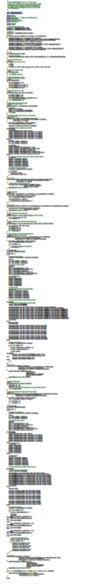
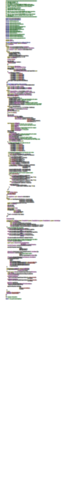

==============================
Introduction
==============================

High-performance computing relies on ever finer threading.
Advances in processor technology include ever greater numbers of cores, hyperthreading, accelerators with integrated blocks of cores, and special vectorized instructions, all of which require more software parallelism to achieve peak performance.
Traditional visualization solutions cannot support this extreme level of concurrency.
Extreme scale systems require a new programming model and a fundamental change in how we design algorithms.
To address these issues we created |Viskores|: the visualization toolkit for multi-/many-core architectures.

|Viskores| supports a number of algorithms and the ability to design further algorithms through a top-down design with an emphasis on extreme parallelism.
|Viskores| also provides support for finding and building links across topologies, making it possible to perform operations that determine manifold surfaces, interpolate generated values, and find adjacencies.
Although |Viskores| provides a simplified high-level interface for programming, its template-based code removes the overhead of abstraction.

.. table:: Comparison of Marching Cubes implementations.
   :name: MCCompare
   :widths: auto
   :align: center

   +-----------------+-----------------+
   | CUDA SDK        | |Viskores|          |
   +-----------------+-----------------+
   | 431 LOC         | 265 LOC         |
   +-----------------+-----------------+
   | |MCCompareCuda| | |MCCompareViskores| |
   +-----------------+-----------------+

|Viskores| simplifies the development of parallel scientific visualization algorithms by providing a framework of supporting functionality that allows developers to focus on visualization operations.
Consider the listings in :numref:`MCCompare` that compares the size of the implementation for the Marching Cubes algorithm in |Viskores| with the equivalent reference implementation in the CUDA software development kit.
Because |Viskores| internally manages the parallel distribution of work and data, the |Viskores| implementation is shorter and easier to maintain.
Additionally, |Viskores| provides data abstractions not provided by other libraries that make code written in |Viskores| more versatile.

------------------------------
How to Use This Guide
------------------------------

This user's guide is organized into 5 parts to help guide novice to advanced users and to provide a convenient reference.
:partref:`part-getting-started:Getting Started` provides a brief overview of using |Viskores|.
This part provides instructions on building |Viskores| and some simple examples of using |Viskores|.
Users new to |Viskores| are well served to read through Part :partref:`part-getting-started:Getting Started` first to become acquainted with the basic concepts.

The remaining parts, which provide detailed documentation of increasing complexity, have chapters that do not need to be read in detail.
Readers will likely find it useful to skip to specific topics of interest.

:partref:`part-using:Using |Viskores|` dives deeper into the |Viskores| library.
It provides much more detail on the concepts introduced in :partref:`part-getting-started:Getting Started` and introduces new topics helpful to people who use |Viskores|'s existing algorithms.

:partref:`part-developing:Developing Algorithms` documents how to use |Viskores|'s framework to develop new or custom visualization algorithms.
In this part we dive into the inner workings of filters and introduce the concept of a *worklet*, which is the base unit used to write a device-portable algorithm in |Viskores|.
:partref:`part-developing:Developing Algorithms` also documents many supporting functions that are helpful in implementing visualization algorithms.

:partref:`part-advanced:Advanced Development` explores in more detail how |Viskores| manages memory and devices.
This information describes how to adapt |Viskores| to custom data structures and new devices.

:partref:`part-core:Core Development` exposes the inner workings of |Viskores|.
These concepts allow you to design new algorithmic structures not already available in |Viskores|.

.. ------------------------------
.. Conventions Used in This Guide
.. ------------------------------
..
.. When documenting the |Viskores| API, the following conventions are used.
.. \begin{itemize}
.. \item Filenames are printed in a \textfilename{sans serif font}.
.. \item C++ code is printed in a \textcode{monospace font}.
.. \item Macros and namespaces from |Viskores| are printed in \textnamespace{red}.
.. \item Identifiers from |Viskores| are printed in \textidentifier{blue}.
.. \item Signatures, described in Chapter \ref{chap:SimpleWorklets}, and the
..   tags used in them are printed in \textsignature{green}.
.. \end{itemize}
..
.. This guide provides actual code samples throughout its discussions to
.. demonstrate their use. These examples are all valid code that can be
.. compiled and used although it is often the case that code snippets are
.. provided. In such cases, the code must be placed in a larger context.

.. didyouknow::
   In this guide we periodically use these **Did you know?** boxes to provide additional information related to the topic at hand.

.. commonerrors::
   **Common Errors** blocks are used to highlight some of the common problems or complications you might encounter when dealing with the topic of discussion.
