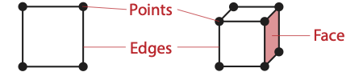

==============================
Working with Cells
==============================

.. index:: cell

In the control environment, data is defined in mesh structures that comprise a set of finite cells.
(See :secref:`dataset:Cell Sets` for information on defining cell sets in the control environment.)
When worklets that operate on cells are scheduled, these grid structures are broken into their independent cells, and that data is handed to the worklet.
Thus, cell-based operations in the execution environment exclusively operate on independent cells.

Unlike some other libraries such as VTK, |Viskores| does not have a cell class that holds all the information pertaining to a cell of a particular type.
Instead, |Viskores| provides tags or identifiers defining the cell shape, and companion data like coordinate and field information are held in separate structures.
This organization is designed so a worklet may specify exactly what information it needs, and only that information will be loaded.

------------------------------
Cell Shape Tags and Ids
------------------------------

.. index::
   double: tag; cell shape
   double: tag; shape

Cell shapes can be specified with either a tag (defined with a struct with a name like ``CellShapeTag*``) or an enumerated identifier (defined with a constant number with a name like ``CELL_SHAPE_*``).
These shape tags and identifiers are defined in :file:`viskores/CellShape.h` and declared in the ``viskores`` namespace (because they can be used in either the control or the execution environment).
:numref:`fig:CellShapes` gives both the identifier and the tag names.

   Basic Cell Shapes.

.. doxygenstruct:: viskores::CellShapeTagVertex
   :members:
.. doxygenenumvalue:: viskores::CELL_SHAPE_VERTEX
.. doxygenstruct:: viskores::CellShapeTagLine
   :members:
.. doxygenenumvalue:: viskores::CELL_SHAPE_LINE
.. doxygenstruct:: viskores::CellShapeTagPolyLine
   :members:
.. doxygenenumvalue:: viskores::CELL_SHAPE_POLY_LINE
.. doxygenstruct:: viskores::CellShapeTagTriangle
   :members:
.. doxygenenumvalue:: viskores::CELL_SHAPE_TRIANGLE
.. doxygenstruct:: viskores::CellShapeTagPolygon
   :members:
.. doxygenenumvalue:: viskores::CELL_SHAPE_POLYGON
.. doxygenstruct:: viskores::CellShapeTagQuad
   :members:
.. doxygenenumvalue:: viskores::CELL_SHAPE_QUAD
.. doxygenstruct:: viskores::CellShapeTagTetra
   :members:
.. doxygenenumvalue:: viskores::CELL_SHAPE_TETRA
.. doxygenstruct:: viskores::CellShapeTagHexahedron
   :members:
.. doxygenenumvalue:: viskores::CELL_SHAPE_HEXAHEDRON
.. doxygenstruct:: viskores::CellShapeTagWedge
   :members:
.. doxygenenumvalue:: viskores::CELL_SHAPE_WEDGE
.. doxygenstruct:: viskores::CellShapeTagPyramid
   :members:
.. doxygenenumvalue:: viskores::CELL_SHAPE_PYRAMID

In addition to the basic cell shapes, there is a special "empty" cell with the identifier :enumerator:`viskores::CELL_SHAPE_EMPTY` and tag :class:`viskores::CellShapeTagEmpty`.
This type of cell has no points, edges, or faces and can be thought of as a placeholder for a null or void cell.

.. doxygenstruct:: viskores::CellShapeTagEmpty
   :members:
.. doxygenenumvalue:: viskores::CELL_SHAPE_EMPTY

There is also a special cell shape "tag" named :class:`viskores::CellShapeTagGeneric` that is used when the actual cell shape is not known at compile time.
:class:`viskores::CellShapeTagGeneric` actually has a member variable named :var:`viskores::CellShapeTagGeneric::Id` that stores the identifier for the cell shape.
There is no equivalent identifier for a generic cell; cell shape identifiers can be placed in a :type:`viskores::IdComponent` at runtime.

.. doxygenstruct:: viskores::CellShapeTagGeneric
   :members:

When using cell shapes in templated classes and functions, you can use the :c:macro:`VISKORES_IS_CELL_SHAPE_TAG` to ensure a type is a valid cell shape tag.
This macro takes one argument and will produce a compile error if the argument is not a cell shape tag type.

.. doxygendefine:: VISKORES_IS_CELL_SHAPE_TAG

Converting Between Tags and Identifiers
========================================

Every cell shape tag has a member variable named ``Id`` that contains the identifier for the cell shape.
This provides a convenient mechanism for converting a cell shape tag to an identifier.
Most cell shape tags have their ``Id`` member as a compile-time constant, but :var:`viskores::CellShapeTagGeneric::Id` is set at run time.

The :file:`viskores/CellShape.h` header also declares a templated class named :class:`viskores::CellShapeIdToTag` that converts a cell shape identifier to a cell shape tag.
:class:`viskores::CellShapeIdToTag` has a single template argument that is the identifier.
Inside the class is a type named :var:`viskores::CellShapeIdToTag::Tag` that is the type of the correct tag.

.. doxygenstruct:: viskores::CellShapeIdToTag
   :members:

.. load-example:: CellShapeIdToTag
   :file: GuideExampleCellShapes.cxx
   :caption: Using :class:`viskores::CellShapeIdToTag`.

However, :class:`viskores::CellShapeIdToTag` is only viable if the identifier can be resolved at compile time.
In the case where a cell identifier is stored in a variable or an array or the code is using a :class:`viskores::CellShapeTagGeneric`, the correct cell shape is not known until run time.
In this case, the :c:macro:`viskoresGenericCellShapeMacro` macro can be used to check all possible conditions.
This macro is embedded in a switch statement where the condition is the cell shape identifier.

.. doxygendefine:: viskoresGenericCellShapeMacro

Often this method is used to implement the condition for a :class:`viskores::CellShapeTagGeneric` in a function overloaded for cell types.
A demonstration of :c:macro:`viskoresGenericCellShapeMacro` is given in :numref:`ex:GenericCellNormal`.

Cell Traits
==============================

.. index:: cell traits

The :file:`viskores/CellTraits.h` header file contains a traits class named :class:`viskores::CellTraits` that provides information about a cell.

.. doxygenstruct:: viskores::CellTraits
   :members:

.. doxygenstruct:: viskores::CellTopologicalDimensionsTag
.. doxygenstruct:: viskores::CellTraitsTagSizeFixed
.. doxygenstruct:: viskores::CellTraitsTagSizeVariable

.. load-example:: GenericCellNormal
   :file: GuideExampleCellShapes.cxx
   :caption: Using :class:`viskores::CellTraits` to implement a polygon normal estimator.

-----------------------------------
Parametric and World Coordinates
-----------------------------------

.. index::
   double: cell; parametric coordinates
   double: cell; world coordinates

Each cell type supports a one-to-one mapping between a set of parametric coordinates in the unit cube (or some subset of it) and the points in 3D space that are the locus contained in the cell.
Parametric coordinates are useful because certain features of the cell, such as vertex location and center, are at a consistent location in parametric space irrespective of the location and distortion of the cell in world space.
Also, many field operations are much easier with parametric coordinates.

The :file:`viskores/exec/ParametricCoordinates.h` header file contains the following functions for working with parametric coordinates.
These functions contain several overloads for using different cell shape tags.

.. doxygenfunction:: viskores::exec::ParametricCoordinatesCenter(viskores::IdComponent, viskores::CellShapeTagGeneric, viskores::Vec<ParametricCoordType, 3>&)
.. doxygenfunction:: viskores::exec::ParametricCoordinatesPoint(viskores::IdComponent, viskores::IdComponent, viskores::CellShapeTagGeneric, viskores::Vec<ParametricCoordType, 3>&)
.. doxygenfunction:: viskores::exec::ParametricCoordinatesToWorldCoordinates(const WorldCoordVector&, const viskores::Vec<PCoordType, 3>&, viskores::CellShapeTagGeneric, typename WorldCoordVector::ComponentType&)
.. doxygenfunction:: viskores::exec::WorldCoordinatesToParametricCoordinates(const WorldCoordVector&, const typename WorldCoordVector::ComponentType&, viskores::CellShapeTagGeneric, typename WorldCoordVector::ComponentType&)

------------------------------
Interpolation
------------------------------

.. index::
   double: cell; interpolation

The shape of every cell is defined by the connections of some finite set of points.
Field values defined on those points can be interpolated to any point within the cell to estimate a continuous field.

The :file:`viskores/exec/CellInterpolate.h` header contains the function :func:`viskores::exec::CellInterpolate` to do this interpolation.

.. doxygenfunction:: viskores::exec::CellInterpolate(const FieldVecType&, const viskores::Vec<ParametricCoordType, 3>&, viskores::CellShapeTagGeneric, typename FieldVecType::ComponentType&)

.. load-example:: CellCenters
   :file: GuideExampleCellOperations.cxx
   :caption: Interpolating field values to a cell's center.

The previous form of :func:`viskores::exec::CellInterpolate` is typically used within a :class:`viskores::worklet::WorkletVisitCellsWithPoints` to interpolate within cells provided by the worklet.
There is another form of :func:`viskores::exec::CellInterpolate` that is used when provided with a cell set structure from a ``WholeCellSetIn``.
Using ``WholeCellSetIn`` is described in more detail in :secref:`globals:Whole Cell Sets`, but the summary is that you can get the shape and incident points of any cell in the mesh.
In this case, the alternate form of :func:`viskores::exec::CellInterpolate` takes a ``Vec`` of the point indices for the cell and an array portal of all field values.

.. doxygenfunction:: viskores::exec::CellInterpolate(const IndicesVecType&, const FieldPortalType&, const viskores::Vec<ParametricCoordType, 3>&, CellShapeTag, typename FieldPortalType::ValueType&)

.. load-example:: CellLookupInterp
   :file: GuideExampleCellOperations.cxx
   :caption: Interpolating field values in a cell queried from a global structure.

------------------------------
Derivatives
------------------------------

.. index::
   double: cell; derivative
   double: cell; gradient

Since interpolations provide a continuous field function over a cell, it is reasonable to consider the derivative of this function.
The :file:`viskores/exec/CellDerivative.h` header contains the function :func:`viskores::exec::CellDerivative` to compute derivatives.
The derivative is returned in a :class:`viskores::Vec` of size 3 corresponding to the partial derivatives in the :math:`x`, :math:`y`, and :math:`z` directions.
This derivative is equivalent to the gradient of the field.

.. load-example:: CellDerivatives
   :file: GuideExampleCellOperations.cxx
   :caption: Computing the derivative of the field at cell centers.

------------------------------
Edges and Faces
------------------------------

.. index::
   single: point
   single: cell; point
   double: cell; shape

As explained earlier in this chapter, a cell is defined by a collection of points and a shape identifier that describes how the points come together to form the structure of the cell.
The cell shapes supported by |Viskores| are documented in :secref:`working-with-cells:Cell Shape Tags and Ids`.
It contains :numref:`fig:CellShapes`, which shows how the points for each shape form the structure of the cell.

.. index::
   single: edge
   single: cell; edge
   single: shape; edge

Most cell shapes can be broken into subelements.
2D and 3D cells have pairs of points that form *edges* at the boundaries of the cell.
Likewise, 3D cells have loops of edges that form *faces* that encase the cell.
:numref:`fig:CellConstituents` demonstrates the relationship of these constituent elements for some example cell shapes.

   The constituent elements (points, edges, and faces) of cells..

The header file :file:`viskores/exec/CellEdge.h` contains a collection of functions to help identify the edges of a cell.

.. doxygenfunction:: viskores::exec::CellEdgeNumberOfEdges(viskores::IdComponent, viskores::CellShapeTagGeneric, viskores::IdComponent&)
.. doxygenfunction:: viskores::exec::CellEdgeLocalIndex(viskores::IdComponent, viskores::IdComponent, viskores::IdComponent, viskores::CellShapeTagGeneric, viskores::IdComponent&)
.. doxygenfunction:: viskores::exec::CellEdgeCanonicalId

The following example demonstrates a pair of worklets that use the cell edge functions.
As is typical for operations of this nature, one worklet counts the number of edges in each cell and another uses this count to generate the data.

.. didyouknow::
   :numref:`ex:CellEdge` demonstrates one of many techniques for creating cell sets in a worklet.
   Chapter~\ref{chap:GeneratingCellSets} describes this and many more such techniques.

.. todo:: Fix chap:GeneratingCellSets reference above.

.. load-example:: CellEdge
   :file: GuideExampleCellEdgesFaces.cxx
   :caption: Using cell edge functions.

.. index::
   single: face
   single: cell; face
   single: shape; face

The header file :file:`viskores/exec/CellFace.h` contains a collection of functions to help identify the faces of a cell.

.. doxygenfunction:: viskores::exec::CellFaceNumberOfFaces
.. doxygenfunction:: viskores::exec::CellFaceNumberOfPoints
.. doxygenfunction:: viskores::exec::CellFaceShape
.. doxygenfunction:: viskores::exec::CellFaceLocalIndex
.. doxygenfunction:: viskores::exec::CellFaceCanonicalId

The following example demonstrates a triple of worklets that use the cell face functions.
As is typical for operations of this nature, the worklets are used in steps to first count entities and then generate new entities.
In this case, the first worklet counts the number of faces and the second worklet counts the points in each face.
The third worklet generates cells for each face.

.. load-example:: CellFace
   :file: GuideExampleCellEdgesFaces.cxx
   :caption: Using cell face functions.
